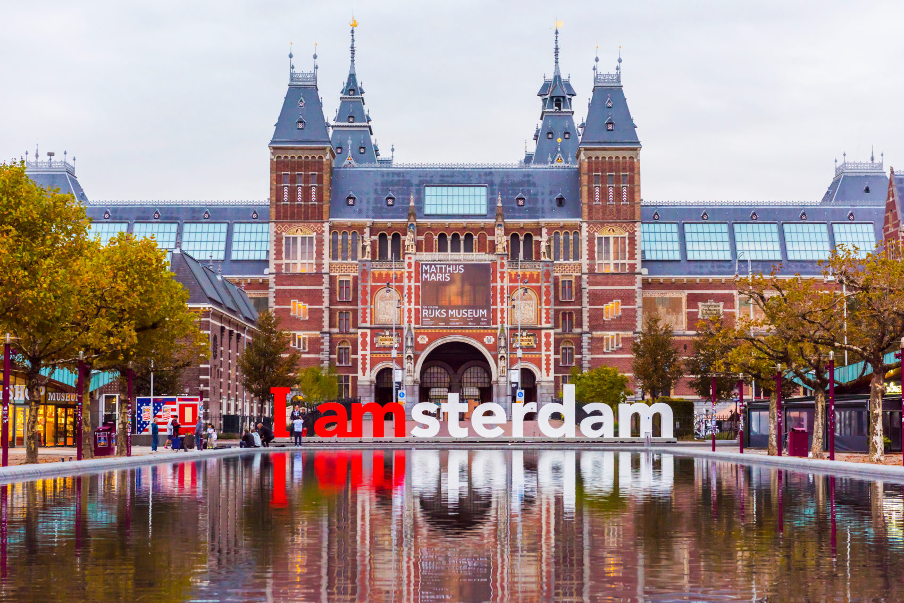
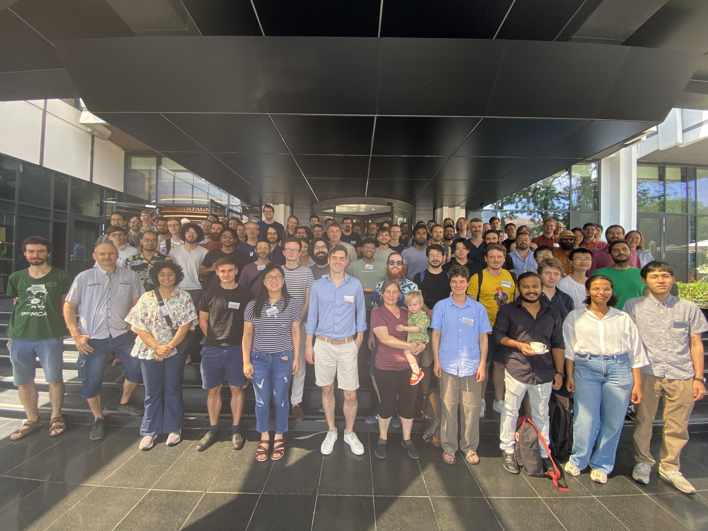
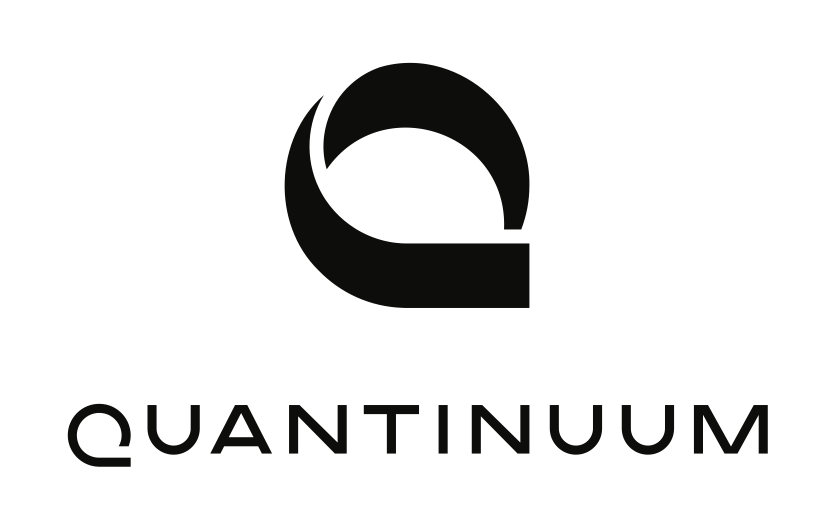

<!--  -->

The **23rd International Conference on Quantum Physics and Logic (QPL 2026)**
will take place from August 17th to August 21st 2026 in Amsterdam, The Netherlands.  Quantum
Physics and Logic is an annual conference that brings together academic and
industry researchers working on mathematical foundations of quantum
computation, quantum physics, and related areas. The main focus is on the use
of algebraic and categorical structures, formal languages, type systems,
logics, semantic methods, as well as other mathematical and computer scientific
techniques applicable to the study of physical systems, physical processes, and
their composition. Work applying quantum-inspired techniques and structures to
other fields, such as linguistics, artificial intelligence, and causality, is
also welcome.

### Important Dates

Conference: August 17th to August 21st 2026

Submission and registration dates to follow.

<!-- * Abstract submission deadline: 9 February 2025
* Paper submission deadline: 16 February 2025
* Notification: 24 March 2025
* Camera-ready deadline (revised accepted proceedings manuscripts): 15 June 2025
* Conference: 14 July -- 18 July 2025 -->

<!-- All deadlines are stated with respect to the [Anywhere on Earth (AoE) time zone](https://www.timeanddate.com/time/zones/aoe). -->

### Submissions

The following are the submission guidelines from the 2025 edition, they are still subject to change.
Prospective speakers are invited to submit one (or more) of the following:

* **Proceedings submission.** This consists of a 5-12 page paper. It must
  provide sufficient evidence of results of genuine interest, in sufficient
  detail for the program committee to assess the merits and correctness of the work.
  Proceedings submissions must use the [EPTCS style files](https://style.eptcs.org/).
* **Talk proposal.** This consists of a 3 page summary, together with
  a link to a separate published paper or preprint. If the published paper or
  preprint is not publicly available (e.g. not open access), then it should be
  included in full after the summary.
* **Poster submission.** This consists of a 3 page summary of results, partial results or
  work in progress.

Page limits exclude bibliography and appendices (which may be read at the
discretion of reviewers). 
<!-- All submissions will be handled by EasyChair.
[Submit here](https://easychair.org/conferences/?conf=qpl2025).
 -->
There will be an award for Best Student Paper that will be determined by the
Program Committee. Papers eligible for the award are those where all the
authors are students at the time of submission.

### Registration

To open later.
<!-- Registration is now closed. Please see [here](/registration/) for further information regarding registrations. -->

<!-- ### Presentations

Authors of accepted proceedings and non-proceedings submissions will be invited
to give a talk. Authors of accepted poster submissions will be invited to present
their work at the poster session.

[Conference program](/program/)

All talks will be 20 minutes long plus 5 minutes for questions. -->
<!-- 
#### Posters

Please see [here](/local_info/#poster-instructions) for guidance on preparing posters. -->

### Conference Proceedings

Conference proceedings will be published in [Electronic Proceedings in
Theoretical Computer Science (EPTCS)](https://about.eptcs.org/) after the
conference. When preparing the final version for publication, authors of
accepted proceedings submissions are allowed to use up to three extra pages
(i.e. up to 15 pages excluding bibliography) to address reviewer concerns and
suggestions under the proviso that they do not introduce new results.

<!-- #### Special Issue
In addition to the proceedings, we will have a Special Issue at JLAMP. [Check the details and the call-for-papers at the journal site](https://www.sciencedirect.com/special-issue/321902/special-issue-on-quantum-physics-and-logic-qpl-2024-and-qpl-2025).
 -->

### Contact

For inquiries related to the submission and review process, please write to the PC chairs at [pcchairsqpl2026@gmail.com](mailto:pcchairsqpl2026@gmail.com). 

<!-- For inquiries related to the conference itself, please write to [qpl.conference.2025@gmail.com](mailto:qpl.conference.2025@gmail.com). -->

<!-- ### Group Photo

 -->
<!-- 
### Platinum Sponsors

-->

<!--
### Organisational Support and Funding

### Other

-->

### Programme Committee Co-chairs

<!-- * [Alejandro Díaz-Caro](https://members.loria.fr/adiazcaro) (Inria, LORIA & Universidad Nacional de Quilmes) -->
* [John van de Wetering](https://vdwetering.name) (University of Amsterdam)
* [Ognyan Oreshkov](http://quic.ulb.ac.be/members/oreshkov) (Université libre de Bruxelles)
* [Ana Belén Sainz](https://www.absainz.com/) (ICTQT, University of Gdansk)

<!-- 
### Programme Committee

To be announced.

* Alastair Abbott
* Pablo Arrighi
* Miriam Backens
* Rui Soares Barbosa
* Ämin Baumeler
* Jessica Bavaresco
* Alessandro Bisio
* Robert Booth
* Cyril Branciard
* Titouan Carette
* Ulysse Chabaud
* Giulio Chiribella
* Bob Coecke
* Marcelo Terra Cunha
* Alejandro Díaz-Caro
* Ross Duncan
* Pierre-Emmanuel Emeriau
* Flaminia Giacomini
* Stefano Gogioso
* Matty Hoban
* Emmanuel Jeandel
* Anna Jenčová
* Robin Kaarsgaard
* Martti Karvonen
* Kohei Kishida
* Aleks Kissinger
* Ravi Kunjwal
* Robin Lorenz
* Glaucia Murta
* Nuriya Nurgalieva
* Ognyan Oreshkov
* Anna Pearson
* Simon Perdrix
* Nicola Pinzani
* Robert Rand
* Neil Ross
* Mehrnoosh Sadrzadeh
* Ana Belén Sainz
* Nitica Sakharwade
* Carlo Maria Scandolo
* John Selby
* Peter Selinger
* Sonja Smets
* Pawel Sobocinski
* Isar Stubbe
* Benoît Valiron
* Augustin Vanrietvelde
* Vilasini Venkatesh
* Renaud Vilmart
* Juliana Kaizer Vizzotto
* Quanlong Wang
* Julian Wechs
* Mirjam Weilenmann
* John van de Wetering
* Alexander Wilce
* Margherita Zorzi -->

### Organising Committee

To be announced.

<!-- * [James Hefford](https://heffordj.github.io/) (Inria, France)
* Timothée Hoffreumon (Université Paris-Saclay, France)
* [Ognyan Oreshkov](http://quic.ulb.ac.be/members/oreshkov) (Chair) (Université libre de Bruxelles, Belgium)
* Eleftherios-Ermis Tselentis (Université libre de Bruxelles, Belgium)
* [Zixiuan Liu](https://liu-zixuan.github.io/) (Université libre de Bruxelles, Belgium)
* [Vladimir Zamdzhiev](https://zamdzhiev.github.io/) (Inria, France) -->

### QPL Steering Committee

* [Bob Coecke](https://www.quantinuum.com/qai/bobcoecke) (Quantinuum) 
* [Ana Belén Sainz](https://www.absainz.com/) (ICTQT, University of Gdansk)
* [Peter Selinger](https://www.mathstat.dal.ca/~selinger/) (Dalhousie University) 

### Previous QPL Editions

An archive of all previous QPL editions is [available](https://www.mathstat.dal.ca/~selinger/qpl/).
 
### Code of Conduct

Please make this conference a welcoming space for everyone. We ask you to use your real name when logging into any of our systems. Our conference is dedicated to providing a harassment-free conference experience for everyone, regardless of gender, gender identity and expression, age, sexual orientation, disability, physical appearance, body size, race, ethnicity, religion (or lack thereof), or scientific opinion. We do not tolerate harassment of community members in any form.

All communication should be appropriate for a professional audience including people of many different backgrounds. Sexual language and imagery is not appropriate for any venue this conference will be held in, whether physical or virtual. If you are being harassed, notice that someone else is being harassed, or have any other concerns, please contact a member of conference staff immediately. If a participant engages in harassing behaviour, the conference organisers may take any action they deem appropriate, including warning the offender or expulsion from the conference.

The dedicated safety and inclusion team will oversee reports of Code of Conduct violation. The team can be contacted at [qpl.safety.inclusion@gmail.com](mailto:qpl.safety.inclusion@gmail.com). The full team is to be announced later, but currently consists of:

* Ana Belén Sainz (ICTQT, University of Gdańsk)

Harassment may include but is not limited to:
* Offensive comments related to gender, gender identity and expression, sexual orientation, disability, physical appearance, body size, race, age, religion, or technology choices;
* Sexual language and images in any workshop platform;
* Deliberate intimidation, stalking, or following;
* Harassing photography or recording;
* Sustained disruption of talks or other events;
* Inappropriate sexual attention;
* Advocating for, or encouraging, any of the above behaviour.
